# CubeMaster

[](https://www.python.org/downloads/)
[](https://pytorch.org/)
[](https://onnxruntime.ai/)
[](https://www.arduino.cc/)
[](LICENSE)

<p align="center">
  
</p>

**An intelligent robotic system that automatically solves Rubik's cubes** using advanced computer vision, machine learning, and precision motor control.

The system captures cube images in two orientations (U,L,F then D,R,B faces) using a single-camera dual-orientation capture system with controlled LED lighting. Images are processed through trained neural networks for color detection, validated mathematically for cube state integrity, solved using the Kociemba two-phase algorithm for optimal solutions, and executed through a 6-axis stepper motor system with G-code interface.

**Core Capabilities:**
- 🤖 **Complete Autonomous Solving** — End-to-end cube solving without human intervention
- 📷 **Dual-Orientation Capture** — Single camera captures all 6 faces in 2 positions
- 🧠 **Multi-Model ML Pipeline** — MLP, Shallow CNN, and MobileNetV3 architectures for robust detection
- ✅ **Mathematical Validation** — Detects impossible cube states before solving
- ⚙️ **G-code Motor Control** — Precision stepper execution with real-time feedback
- 💡 **Controlled Lighting** — GPIO-driven LED array for consistent color capture

**Hardware Platform:**
- 🔧 **RAMPS 1.4** controller with 6× NEMA 17 steppers (12V direct)
- 📷 **USB Camera** (1080p fixed focus) with custom mount
- 🖥️ **Raspberry Pi 5** for vision processing and coordination
- 💡 **3× CHANZON 3W White LEDs** (6000K-6500K) with level shifter
- 📟 **HD44780 1602 LCD** for status display and user feedback
- 🔘 **4-Button Control Panel** for menu navigation (GPIO)
- ⚡ **20A 300W Buck Converter** (12V→5V) for digital components

**Tech Stack:** `Python` • `PyTorch 2.0+ / torchvision` • `MLP` • `Shallow CNN` • `MobileNetV3 Transfer Learning` • `Albumentations` • `OpenCV` • `ONNX Runtime` • `Kociemba Algorithm` • `Arduino / Marlin` • `HD44780 LCD` • `G-code` • `Serial Communication`

## 📋 Table of Contents

- **[1. System Architecture](#system-architecture)**
  - [Hardware Architecture](#hardware-architecture)
    - [Component Details](#component-details)
    - [Power Distribution](#power-distribution)
    - [LED Driver Circuit](#led-driver-circuit)
    - [RAMPS 1.4 6-Axis Extension](#ramps-14-6-axis-extension)
    - [Wiring Diagram](#wiring-diagram)
    - [Communication Protocol](#communication-protocol)
    - [G-code Reference](#g-code-reference)
    - [Mechanical Design & CAD](#mechanical-design--cad)
  - [Software Architecture](#software-architecture)
    - [Component Overview](#component-overview)
    - [Inter-Component Communication](#inter-component-communication)
    - [Kociemba Solver Integration](#kociemba-solver-integration)
    - [Module Organization](#module-organization)

- **[2. Data Pipeline](#data-pipeline)**
  - [Dataset Structure](#dataset-structure)
  - [Color Classes](#color-classes)
  - [Image Preprocessing](#image-preprocessing)
  - [Data Augmentation](#data-augmentation)

- **[3. Model Architectures](#model-architectures)**
  - [Model Comparison Summary](#model-comparison-summary)
  - [MLP (Multi-Layer Perceptron)](#1-mlp-multi-layer-perceptron)
  - [Shallow CNN](#2-shallow-cnn)
  - [MobileNetV3 (Transfer Learning)](#3-mobilenetv3-transfer-learning)

- **[4. Training Infrastructure](#training-infrastructure)**
  - [Configuration System](#configuration-system)
  - [Training Script Usage](#training-script-usage)
  - [Early Stopping](#early-stopping)
  - [Checkpoint Management](#checkpoint-management)

- **[5. Evaluation & Comparison](#evaluation--comparison)**
  - [Evaluation Script](#evaluation-script)
  - [Output Files](#output-files)
  - [MLP Test Results](#mlp-test-results)
  - [Shallow CNN Test Results](#shallow-cnn-test-results)

- **[6. Installation & Quick Start](#installation--quick-start)**
  - [Prerequisites](#prerequisites)
  - [Setup](#setup)
  - [Quick Start Guide](#quick-start-guide)

---

## System Architecture

### Hardware Architecture

The CubeMaster robot uses a distributed architecture with dedicated components for vision, computation, and motor control.


#### Component Details

| Component | Specification | Purpose |
|-----------|--------------|---------|
| **Raspberry Pi 5** | 8GB RAM | Main compute - runs ML inference, Kociemba solver |
| **USB Camera** | 1080p, fixed focus | Captures cube face images for color detection |
| **Arduino Mega 2560** | ATmega2560 | Motor controller running Marlin firmware |
| **RAMPS 1.4** | Extended 6-axis | Stepper driver board (A4988/DRV8825 drivers) |
| **NEMA 17 Steppers** | 6 units | One motor per cube face for 90°/180° rotations |
| **LED Array** | 3× CHANZON 3W White (6000K-6500K, 600-700mA, 3V-3.4V) | Consistent illumination for color detection |
| **LCD Display** | HD44780 1602 I2C | Shows detected state, solving progress, move count |
| **Control Buttons** | 4× Tactile switches (GPIO) | Menu navigation: Up/Down/Select/Back |
| **Buck Converter** | 20A 300W CC CV (DC 6-40V → 1.2-36V) | Steps down 12V to 5V for RPi, Arduino, LCD |
| **Level Shifter** | 5V → 3V-3.4V | Voltage conversion for LED array |

#### Power Distribution

| Rail | Source | Destination | Notes |
|------|--------|-------------|-------|
| **12V Input** | Power Supply | Buck Converter, RAMPS 1.4 | Main power input |
| **12V Direct** | Power Supply | RAMPS 1.4 → Motor Drivers → NEMA 17 | Stepper motor power |
| **5V Regulated** | Buck Converter | Raspberry Pi 5, Arduino, LCD, Level Shifter | Digital components |
| **3V-3.4V** | Level Shifter | LED Array (3× 3W LEDs) | LED operating voltage |

#### LED Driver Circuit

```mermaid
flowchart TB
    subgraph PI["Raspberry Pi GPIO (3.3V)"]
        GPIO[GPIO Pin<br/>On/Off Control]
    end

    subgraph POWER["Power Chain"]
        V5[5V Rail<br/>from Buck Converter]
        SHIFT[Level Shifter<br/>5V → 3V-3.4V]
    end

    subgraph DRIVER["NPN Driver Circuit"]
        R[1kΩ Resistor]
        NPN[2N2222 NPN<br/>Transistor]
    end

    subgraph LOAD["LED Array"]
        LED[3× CHANZON 3W LEDs<br/>6000K-6500K<br/>600-700mA @ 3V-3.4V]
    end

    GND[GND]

    V5 --> SHIFT
    SHIFT --> LED
    GPIO --> R
    R --> NPN
    LED --> NPN
    NPN --> GND

    style PI fill:#c8e6c9,stroke:#2e7d32
    style POWER fill:#e3f2fd,stroke:#1565c0
    style DRIVER fill:#fff9c4,stroke:#f9a825
    style LOAD fill:#ffecb3,stroke:#ff6f00
```



#### RAMPS 1.4 6-Axis Extension

The standard RAMPS 1.4 board supports 5 stepper motor drivers (X, Y, Z, E0, E1). CubeMaster requires 6 motors (one per cube face), so the board is extended using the auxiliary pins.

**6th Motor Driver Connection:**

| Signal | Arduino Mega Pin | RAMPS 1.4 Location | Notes |
|--------|------------------|-------------------|-------|
| **STEP** | D6 (AUX-2) | AUX-2 Header Pin 1 | Step pulse signal |
| **DIR** | D5 (AUX-2) | AUX-2 Header Pin 2 | Direction control |
| **EN** | D4 (AUX-2) | AUX-2 Header Pin 3 | Enable (active low) |
| **MS1** | Directly on driver | Microstepping config | Typically tied HIGH |
| **MS2** | Directly on driver | Microstepping config | Typically tied HIGH |
| **MS3** | Directly on driver | Microstepping config | 1/16 microstepping |

**Hardware Setup:**
1. Mount 6th A4988/DRV8825 driver on external breakout board
2. Connect STEP, DIR, EN signals from AUX-2 header to driver
3. Connect VMOT (12V) and GND from RAMPS power terminals
4. Set microstepping jumpers on the external driver (typically 1/16)
5. Connect motor coils (A1, A2, B1, B2) to NEMA 17 stepper

**Marlin Firmware Configuration:**
```cpp
// Configuration.h - Define 6th axis as E2 extruder
#define EXTRUDERS 3  // Use E2 for 6th cube face motor

// pins_RAMPS.h - Add pin definitions for 6th driver
#define E2_STEP_PIN    6   // AUX-2
#define E2_DIR_PIN     5   // AUX-2
#define E2_ENABLE_PIN  4   // AUX-2
```

**Motor Axis Mapping:**

| Cube Face | Motor Axis | RAMPS Driver | Marlin Axis |
|-----------|------------|--------------|-------------|
| Up (U) | Motor 0 | X | X_AXIS |
| Down (D) | Motor 1 | Y | Y_AXIS |
| Front (F) | Motor 2 | Z | Z_AXIS |
| Back (B) | Motor 3 | E0 | E0_AXIS |
| Left (L) | Motor 4 | E1 | E1_AXIS |
| Right (R) | Motor 5 | E2 (AUX-2) | E2_AXIS |

#### Wiring Diagram


#### Communication Protocol

1. **Pi → Arduino**: Serial commands over USB (115200 baud, G-code style)
   - `M100 F0 D90` - Rotate Face 0 by 90 degrees
   - `M100 F2 D-90` - Rotate Face 2 by -90 degrees (counter-clockwise)
   - `M101` - Home all axes
   - `M17` - Enable all stepper motors
   - `M18` - Disable all stepper motors

2. **Arduino → Pi**: Status feedback
   - `ok` - Command executed successfully
   - `error:N` - Error code N occurred

#### G-code Reference

| Command | Parameters | Description | Example |
|---------|------------|-------------|---------|
| `M100` | `F<face> D<degrees>` | Rotate specified face | `M100 F0 D90` |
| `M101` | None | Home all axes | `M101` |
| `M102` | `F<face>` | Home single axis | `M102 F3` |
| `M17` | None | Enable all steppers | `M17` |
| `M18` | None | Disable all steppers | `M18` |
| `M119` | None | Report endstop status | `M119` |

**Face Index Mapping:**

| Index | Face | Standard Notation | Motor |
|-------|------|-------------------|-------|
| 0 | Up | U | X-axis |
| 1 | Down | D | Y-axis |
| 2 | Front | F | Z-axis |
| 3 | Back | B | E0-axis |
| 4 | Left | L | E1-axis |
| 5 | Right | R | E2-axis (AUX-2) |

**Rotation Values:**
- `D90` - Clockwise 90° (when viewing face)
- `D-90` - Counter-clockwise 90°
- `D180` - Half turn (180°)

#### Mechanical Design & CAD

The CubeMaster mechanical system consists of two primary assemblies: a **Scanner Assembly** for vision-based cube state detection, and a **Solver Assembly** for motorized cube manipulation. Both assemblies are designed for 3D printing with standard FDM printers using PLA or PETG filament.

##### Scanner Assembly

The scanner assembly provides a fixed mounting system for the USB camera and LED array, with an angled cube holder that enables 3-face simultaneous capture for efficient cube state detection.

**Key Components:**
- **Camera Mount**: Fixed-position bracket holding USB camera at optimal focal distance
- **LED Ring/Array Mount**: Positions 3× CHANZON 3W LEDs for uniform illumination
- **Angled Cube Holder**: Positions the cube at 45° on its corner/tip, exposing 3 faces to the camera

**Scanning Process:**
1. Place cube in angled holder (resting on corner)
2. Camera captures 3 visible faces (U, L, F) — 27 facelets total (9 + 9 + 9)
3. Use LCD menu buttons to trigger first capture
4. Manually flip cube to expose opposite 3 faces (D, R, B)
5. Use LCD menu buttons to trigger second capture
6. Manually transfer cube from scanner to solver assembly

**Design Considerations:**
- 45° angled holder ensures exactly 3 faces visible in each capture
- Camera positioned to capture all 27 facelets with minimal perspective distortion
- LED placement optimized to eliminate shadows and specular reflections
- Cube holder accommodates standard 56mm Rubik's cube dimensions

<p align="center">
  <br>
  <em>Scanner assembly front view showing LCD display and angled cube holder with cube positioned at 45° angle</em>
</p>

<p align="center">
  <br>
  <em>Scanner assembly bottom/underside view showing LED array and camera looking down</em>
</p>

##### Solver Assembly

The solver assembly uses a 3D-printed base with a flexible-arm, snap-fit design for cube loading. The system consists of a base unit holding 5 motors and a separate lid assembly with the 6th motor.

**Key Components:**
- **Base Unit**: 3D-printed base housing 5 NEMA 17 stepper motors
  - 1× Bottom motor (Down face) — mounted vertically in center
  - 4× Side motors (Front, Back, Left, Right) — mounted horizontally around perimeter
- **Lid Assembly**: Separate top piece with 1× motor (Up face)
- **Grippers**: Squarish holders attached to each motor shaft with cavity fitting cube center caps
- **Flexible Side Arms**: Side motor mounts designed to flex outward for cube loading

**Motor Configuration:**

| Position | Face | Motor Location |
|----------|------|----------------|
| Bottom | Down (D) | Center of base, vertical |
| Front | Front (F) | Base perimeter, horizontal |
| Back | Back (B) | Base perimeter, horizontal |
| Left | Left (L) | Base perimeter, horizontal |
| Right | Right (R) | Base perimeter, horizontal |
| Top | Up (U) | Lid assembly, vertical |

**Cube Loading Process:**
1. Flex the 4 side motor arms slightly outward
2. Place cube in center position, resting on bottom motor gripper
3. Release side arms — they snap gently into contact with cube's side faces
4. Place lid assembly on top, engaging the Up face gripper
5. Cube is now secured by all 6 grippers for manipulation

**Design Considerations:**
- Flexible arm design eliminates need for complex mechanisms
- Snap-fit engagement provides secure grip without over-constraining
- Gripper cavities sized for standard 56mm cube center caps
- Lid is removable for easy cube insertion/removal
- All components designed for FDM 3D printing

<p align="center">
  <br>
  <em>Solver base unit top view showing 5 NEMA 17 motors (1 center bottom + 4 side motors) with gripper caps visible</em>
</p>

<p align="center">
  <br>
  <em>Solver assembly top view with cube loaded, showing all 5 base motors engaged with cube faces</em>
</p>

<p align="center">
  <br>
  <em>Solver top view showing motor arrangement and cube loading configuration</em>
</p>

##### Design Files

CAD files are located in the `hardware/cad/` directory:

```
hardware/cad/
├── scanner/
│   ├── scanner_assembly.step      # Complete scanner assembly
│   ├── camera_mount.stl           # Camera bracket (3D print)
│   ├── led_mount.stl              # LED array holder (3D print)
│   ├── cube_holder_angled.stl     # 45° angled cube holder (3D print)
│   └── scanner_base.stl           # Base plate (3D print)
├── solver/
│   ├── solver_assembly.step       # Complete solver assembly
│   ├── base_unit.stl              # Main base with bottom motor mount (3D print)
│   ├── side_arm.stl               # Flexible side motor arm (3D print, qty: 4)
│   ├── lid_assembly.stl           # Top lid with Up motor mount (3D print)
│   └── gripper.stl                # Squarish center cap gripper (3D print, qty: 6)
└── README.md                      # Assembly instructions and print settings
```

**Recommended Print Settings:**
| Parameter | Value |
|-----------|-------|
| Layer Height | 0.2mm |
| Infill | 30-50% |
| Material | PLA or PETG |
| Supports | Required for motor mounts, lid |
| Perimeters | 3-4 walls (4+ for flexible arms) |

### Software Architecture

The CubeMaster software is organized into four main components that run across different hardware platforms:


#### Component Overview

##### 1. Raspberry Pi 5 — System Control

The system control layer manages user interaction and coordinates all operations on the Raspberry Pi 5.

| Component | Responsibility |
|-----------|----------------|
| **LCD Menu System** | Displays status, menus, and solving progress on HD44780 1602 LCD via I2C |
| **Button Handler** | Processes 4-button input (Up/Down/Select/Back) via GPIO for menu navigation |
| **System Coordinator** | Orchestrates scanning, solving, and execution workflows |
| **LED Controller** | Manages LED array for consistent illumination during capture |

**Key Functions:**
- Menu-driven interface for scan, solve, and calibration operations
- Coordinates camera capture timing with LED control
- Manages state transitions between scanning and solving phases
- Provides user feedback via LCD during all operations

##### 2. Raspberry Pi 5 — ML Inference Pipeline

The inference pipeline runs the production color detection and solving algorithms on the Raspberry Pi 5.

| Stage | Input | Output | Description |
|-------|-------|--------|-------------|
| **Camera Capture** | USB Camera | RGB Image | Captures cube face at 45° angle (3 faces visible) |
| **Color Detection** | 40×40 patches | Color labels | ONNX model inference for 6-class classification |
| **Kociemba Solver** | 54-facelet string | Move sequence | Two-phase algorithm generates optimal solution |
| **G-code Generator** | Move sequence | G-code commands | Converts cube notation (R, U', F2) to M100 commands |

**Data Flow:**
```
Camera → Image Patches → Model Inference → Cube State String → Kociemba → Moves → G-code → Serial
```

##### 3. Desktop/Workstation — Training Infrastructure

The training infrastructure runs on a desktop or workstation with GPU support for model development.

| Component | Purpose |
|-----------|---------|
| **Dataset Preparation** | Image preprocessing, patch extraction, train/val/test splitting |
| **Model Training** | PyTorch training loop with early stopping, checkpointing |
| **Data Augmentation** | Albumentations pipelines for robust color detection |
| **Evaluation Tools** | Metrics calculation, model comparison, confusion matrices |

**Deployment Workflow:**
1. Train models on desktop with GPU acceleration
2. Export best model to ONNX format
3. Transfer `.onnx` file to Raspberry Pi 5
4. Inference pipeline loads ONNX model via ONNX Runtime

##### 4. Arduino Mega 2560 — Marlin Firmware

The Arduino runs modified Marlin firmware for 6-axis stepper motor control.

| Component | Responsibility |
|-----------|----------------|
| **G-code Interpreter** | Parses M100/M101/M102 commands from serial input |
| **Stepper Control** | Coordinates 6× A4988 drivers for precise 90°/180° rotations |
| **Homing & Safety** | Manages homing sequence and motor enable/disable states |
| **Status Reporting** | Returns `ok` or `error:N` responses to Raspberry Pi |

**Communication Protocol:**
- Baud rate: 115200
- Format: G-code style ASCII commands
- Flow: Command → Execution → Response → Next command

#### Inter-Component Communication


#### Kociemba Solver Integration

The Kociemba two-phase algorithm generates optimal solutions for any valid cube state. This section describes how the ML inference pipeline integrates with the solver. For details on the color detection models, see [Model Architectures](#model-architectures).

##### Cube State Detection Workflow

```mermaid
flowchart LR
    subgraph DETECT["🔍 Detection Phase"]
        A[📷 Capture<br/>6 Faces] --> B[🔲 Detect<br/>54 Facelets]
        B --> C[🎨 Classify<br/>Colors]
    end

    subgraph VALIDATE["✅ Validation"]
        D{Validate<br/>Cube State}
        D -->|Valid| E[Cube String]
        D -->|Invalid| F[❌ Error<br/>User Override]
        F --> D
    end

    subgraph SOLVE["🧩 Solving Phase"]
        G[Kociemba<br/>Two-Phase] --> H[Parse<br/>Solution]
        H --> I[Generate<br/>G-code]
    end

    subgraph EXEC["⚙️ Execution"]
        J[🤖 Execute<br/>Motor Moves]
    end

    C --> D
    E --> G
    I --> J

    style DETECT fill:#e3f2fd,stroke:#1565c0
    style VALIDATE fill:#fff8e1,stroke:#ff8f00
    style SOLVE fill:#e8f5e9,stroke:#2e7d32
    style EXEC fill:#fce4ec,stroke:#c2185b
```



##### Cube State Format

The Kociemba solver expects a 54-character string representing all facelets:

```
             ┌──────────┐
             │  U1 U2 U3 │
             │  U4 U5 U6 │
             │  U7 U8 U9 │
┌──────────┬─┴──────────┴─┬──────────┬──────────┐
│ L1 L2 L3 │  F1 F2 F3   │ R1 R2 R3 │ B1 B2 B3 │
│ L4 L5 L6 │  F4 F5 F6   │ R4 R5 R6 │ B4 B5 B6 │
│ L7 L8 L9 │  F7 F8 F9   │ R7 R8 R9 │ B7 B8 B9 │
└──────────┴─┬──────────┬─┴──────────┴──────────┘
             │  D1 D2 D3 │
             │  D4 D5 D6 │
             │  D7 D8 D9 │
             └──────────┘

Face Order: U R F D L B (Up, Right, Front, Down, Left, Back)
String: "UUUUUUUUURRRRRRRRRFFFFFFFFFDDDDDDDDDLLLLLLLLLBBBBBBBBB"
```

##### Error Detection

The Kociemba solver validates cube states and returns specific error codes for invalid configurations:

| Error | Description | Typical Cause |
|-------|-------------|---------------|
| **Error 1** | Not exactly 9 facelets of each color | Color misdetection |
| **Error 2** | Not all 12 edges exist exactly once | Impossible edge configuration |
| **Error 3** | Flip error - one edge must be flipped | Physically impossible state |
| **Error 4** | Not all 8 corners exist exactly once | Impossible corner configuration |
| **Error 5** | Twist error - one corner must be twisted | Physically impossible state |
| **Error 6** | Parity error - pieces must be exchanged | Mathematically unsolvable |

These errors catch detection mistakes because a valid Rubik's Cube has strict mathematical constraints—not every 54-facelet configuration is physically achievable.

##### Validation Pipeline

```mermaid
flowchart TD
    START[54 Detected Colors] --> COUNT{Color Count<br/>Check}
    COUNT -->|Each color = 9| CENTER{Center Square<br/>Validation}
    COUNT -->|Mismatch| ERR1[❌ Error 1<br/>Invalid counts]

    CENTER -->|6 unique centers| KOCI{Kociemba<br/>Validation}
    CENTER -->|Duplicates| ERR_CTR[❌ Duplicate<br/>center colors]

    KOCI -->|Valid| SUCCESS[✅ Valid State<br/>Ready to solve]
    KOCI -->|Error 2-6| ERRS[❌ Mathematical<br/>constraint violation]

    ERR1 --> OVERRIDE[User Override<br/>Interface]
    ERR_CTR --> OVERRIDE
    ERRS --> OVERRIDE

    OVERRIDE --> RETRY[Retry Detection]
    OVERRIDE --> MANUAL[Manual Correction]
    RETRY --> START
    MANUAL --> START

    style SUCCESS fill:#c8e6c9,stroke:#2e7d32
    style ERR1 fill:#ffcdd2,stroke:#c62828
    style ERR_CTR fill:#ffcdd2,stroke:#c62828
    style ERRS fill:#ffcdd2,stroke:#c62828
    style OVERRIDE fill:#fff3e0,stroke:#ef6c00
```



**Validation Code Example:**

```python
def validate_cube_state(colors: List[str]) -> Tuple[bool, str]:
    """
    Validate detected cube state before solving.

    Returns:
        (is_valid, error_message)
    """
    # 1. Color count validation - exactly 9 of each color
    counts = Counter(colors)
    if not all(count == 9 for count in counts.values()):
        return False, "Error 1: Invalid color counts"

    # 2. Center square validation - centers define face colors
    centers = [colors[4], colors[13], colors[22], colors[31], colors[40], colors[49]]
    if len(set(centers)) != 6:
        return False, "Duplicate center colors detected"

    # 3. Kociemba validation - mathematical constraints
    result = kociemba.solve(cube_string)
    if result.startswith("Error"):
        return False, result

    return True, "Valid cube state"
```

##### User Override Interface

When validation fails, the system presents an interactive correction interface:

```
╔══════════════════════════════════════════════════════════╗
║           CUBE STATE VALIDATION FAILED                    ║
╠══════════════════════════════════════════════════════════╣
║  Error: Not exactly 9 facelets of each color             ║
║                                                           ║
║  Detected counts:                                         ║
║    B: 8  G: 9  O: 10  R: 9  W: 9  Y: 9                   ║
║                                                           ║
║  Likely misdetection: O → B on Face 2, Position 5        ║
╠══════════════════════════════════════════════════════════╣
║  [1] Retry detection with adjusted lighting              ║
║  [2] Manual correction mode                               ║
║  [3] Override and proceed (not recommended)              ║
║  [4] Cancel                                               ║
╚══════════════════════════════════════════════════════════╝
```

**Manual Correction Mode**:
- LCD displays current detected state with face grid
- User can navigate using buttons to select specific facelets
- Cycle through colors to correct misdetections
- Confirm and re-validate

#### Module Organization

```
src/cubemaster/
├── models/           # Neural network architectures
│   ├── base.py       # Base classifier class
│   ├── mlp.py        # Multi-layer perceptron
│   ├── shallow_cnn.py # 3-layer CNN
│   └── mobilenet.py  # MobileNetV3 transfer learning
├── training/         # Training infrastructure
│   ├── dataset.py    # PyTorch Dataset class
│   ├── augmentations.py # Albumentations pipelines
│   └── trainer.py    # Training loop with early stopping
├── evaluation/       # Metrics and evaluation
│   └── metrics.py    # Accuracy, precision, recall, F1
├── solver/           # Cube solving algorithms
│   └── kociemba/     # Two-phase algorithm
├── vision/           # Image processing
├── hardware/         # Motor control interface
├── inference/        # ONNX runtime inference
├── ui/               # User interface components
└── utils/            # Configuration, logging
```

---

## Data Pipeline

This section describes the dataset structure and preprocessing pipeline used to train the color classification models. The training data flows through this pipeline before being fed to the [Model Architectures](#model-architectures) for training. At inference time, the [ML Inference Pipeline](#2-raspberry-pi-5--ml-inference-pipeline) applies similar preprocessing to camera captures before feeding them to the deployed ONNX model.

### Dataset Structure

The color classification dataset consists of 40×40 RGB image patches extracted from cube facelet regions. Each patch represents a single cube sticker with its dominant color.

```
data/
├── raw/                    # Original captured images
├── processed/              # Split dataset ready for training
│   ├── train/              # Training set (~70%)
│   │   ├── B/              # Blue samples
│   │   ├── G/              # Green samples
│   │   ├── O/              # Orange samples
│   │   ├── R/              # Red samples
│   │   ├── W/              # White samples
│   │   └── Y/              # Yellow samples
│   ├── val/                # Validation set (~15%)
│   └── test/               # Test set (~15%)
└── metadata/               # Dataset statistics
```

### Color Classes

| Class | Color | Description |
|-------|-------|-------------|
| **B** | Blue | Standard Rubik's cube blue |
| **G** | Green | Standard Rubik's cube green |
| **O** | Orange | Standard Rubik's cube orange |
| **R** | Red | Standard Rubik's cube red |
| **W** | White | Standard Rubik's cube white |
| **Y** | Yellow | Standard Rubik's cube yellow |

### Image Preprocessing

1. **Extraction**: 40×40 pixel patches from detected facelet regions
2. **Resize**: Scale to model input size (40×40 for CNN/MLP, 224×224 for MobileNet)
3. **Normalization**: ImageNet statistics (mean=[0.485, 0.456, 0.406], std=[0.229, 0.224, 0.225])

### Data Augmentation

Training augmentations are applied using **Albumentations** to improve robustness:

| Augmentation | Parameters | Purpose |
|--------------|------------|---------|
| HorizontalFlip | p=0.5 | Orientation invariance |
| Rotation | ±15° | Handle camera angle variations |
| RandomBrightnessContrast | ±20% | Lighting condition robustness |
| HueSaturationValue | H±10, S±20 | Color temperature variations |
| GaussNoise | σ=0.01-0.05 | Sensor noise simulation |

```python
# Example augmentation pipeline (from augmentations.py)
transforms = A.Compose([
    A.Resize(40, 40),
    A.HorizontalFlip(p=0.5),
    A.Rotate(limit=15, p=0.5),
    A.RandomBrightnessContrast(brightness_limit=0.2, contrast_limit=0.2, p=0.5),
    A.HueSaturationValue(hue_shift_limit=10, sat_shift_limit=20, p=0.5),
    A.GaussNoise(std_range=(0.01, 0.05), p=0.3),
    A.Normalize(mean=[0.485, 0.456, 0.406], std=[0.229, 0.224, 0.225]),
    ToTensorV2(),
])
```

### PyTorch DataLoader

```python
from cubemaster.training.dataset import CubeColorDataset
from cubemaster.training.augmentations import get_train_transforms

transform = get_train_transforms(image_size=(40, 40), config=aug_config)
dataset = CubeColorDataset("data/processed/train", transform=transform)
loader = DataLoader(dataset, batch_size=32, shuffle=True, num_workers=2)
```

---

## Model Architectures

CubeMaster provides three model architectures optimized for different deployment scenarios. These models are trained on the 40×40 RGB patches from the [Data Pipeline](#data-pipeline) and deployed to the Raspberry Pi 5 via ONNX export (see [Software Architecture](#software-architecture)). The [Kociemba Solver Integration](#kociemba-solver-integration) uses these models' predictions to construct the cube state string.

### Model Comparison Summary

| Model | Parameters | Input Size | Test Accuracy | Use Case |
|-------|------------|------------|---------------|----------|
| **MLP** | ~1.3M | 40×40 | 93.80% | Baseline, interpretability |
| **Shallow CNN** | ~80K | 40×40 | 96.90% | Edge deployment, real-time |
| **MobileNetV3** | ~1.5M | 224×224 | 98-99.5%* | Maximum accuracy |

*MobileNetV3 accuracy is target/expected; actual results pending training.

### 1. MLP (Multi-Layer Perceptron)

A simple fully-connected baseline model for comparison and interpretability studies.

```mermaid
flowchart TB
    subgraph MLP["MLP Architecture (~1.27M params)"]
        INPUT["📷 Input<br/>40×40×3 RGB"]
        FLAT["Flatten<br/>→ 4,800 features"]
        FC1["FC: 4800→256<br/>ReLU + Dropout(0.3)"]
        FC2["FC: 256→128<br/>ReLU + Dropout(0.3)"]
        FC3["FC: 128→6<br/>Softmax"]
        OUTPUT["🎨 Output<br/>6 Color Classes"]

        INPUT --> FLAT
        FLAT --> FC1
        FC1 --> FC2
        FC2 --> FC3
        FC3 --> OUTPUT
    end

    style INPUT fill:#e3f2fd,stroke:#1565c0
    style OUTPUT fill:#c8e6c9,stroke:#2e7d32
    style FC1 fill:#fff3e0,stroke:#ef6c00
    style FC2 fill:#fff3e0,stroke:#ef6c00
    style FC3 fill:#fce4ec,stroke:#c2185b
```



**Configuration** (`configs/mlp.yaml`):
```yaml
model:
  name: "mlp"
  hidden_dims: [256, 128]
  dropout_rate: 0.3
training:
  batch_size: 64
  epochs: 10
optimizer:
  lr: 0.0005
```

### 2. Shallow CNN

A lightweight 3-layer CNN optimized for edge deployment on Raspberry Pi.

```mermaid
flowchart TB
    subgraph CNN["Shallow CNN Architecture (~80K params)"]
        INPUT["📷 Input<br/>40×40×3 RGB"]

        subgraph FEAT["Feature Extractor"]
            CONV1["Conv2D 3→32, 3×3<br/>ReLU + MaxPool 2×2<br/>→ 20×20×32"]
            CONV2["Conv2D 32→64, 3×3<br/>ReLU + MaxPool 2×2<br/>→ 10×10×64"]
            CONV3["Conv2D 64→64, 3×3<br/>ReLU<br/>→ 10×10×64"]
        end

        subgraph CLASS["Classifier"]
            FLAT["Flatten → 6,400"]
            FC1["FC: 6400→64<br/>ReLU + Dropout(0.5)"]
            FC2["FC: 64→6<br/>Softmax"]
        end

        OUTPUT["🎨 Output<br/>6 Color Classes"]

        INPUT --> CONV1
        CONV1 --> CONV2
        CONV2 --> CONV3
        CONV3 --> FLAT
        FLAT --> FC1
        FC1 --> FC2
        FC2 --> OUTPUT
    end

    style INPUT fill:#e3f2fd,stroke:#1565c0
    style OUTPUT fill:#c8e6c9,stroke:#2e7d32
    style FEAT fill:#e8eaf6,stroke:#3f51b5
    style CLASS fill:#fff3e0,stroke:#ef6c00
```



**Configuration** (`configs/shallow_cnn.yaml`):
```yaml
model:
  name: "shallow_cnn"
  dropout_rate: 0.5
training:
  batch_size: 32
  epochs: 10
optimizer:
  lr: 0.001
```

### 3. MobileNetV3 (Transfer Learning)

ImageNet-pretrained MobileNetV3-Small with custom classification head for maximum accuracy.

```mermaid
flowchart TB
    subgraph MOBILE["MobileNetV3-Small (~1.53M params, ~66K trainable)"]
        INPUT["📷 Input<br/>224×224×3 RGB"]

        subgraph BACKBONE["🔒 Frozen Backbone (ImageNet pretrained)"]
            IR["Inverted Residual Blocks"]
            SE["Squeeze-and-Excitation"]
            HS["Hard-Swish Activations"]
            IR --> SE --> HS
        end

        FEATURES["576 Features"]

        subgraph HEAD["🔓 Custom Classification Head"]
            FC1["FC: 576→256<br/>Hardswish"]
            DROP["Dropout(0.2)"]
            FC2["FC: 256→6"]
        end

        OUTPUT["🎨 Output<br/>6 Color Classes"]

        INPUT --> BACKBONE
        BACKBONE --> FEATURES
        FEATURES --> FC1
        FC1 --> DROP
        DROP --> FC2
        FC2 --> OUTPUT
    end

    style INPUT fill:#e3f2fd,stroke:#1565c0
    style OUTPUT fill:#c8e6c9,stroke:#2e7d32
    style BACKBONE fill:#eceff1,stroke:#607d8b
    style HEAD fill:#fff3e0,stroke:#ef6c00
```



**Configuration** (`configs/mobilenet.yaml`):
```yaml
model:
  name: "mobilenet"
  pretrained: true
  freeze_backbone: true
  dropout_rate: 0.2
data:
  image_size: [224, 224]
training:
  batch_size: 16
  epochs: 50
```

---

## Training Infrastructure

### Configuration System

CubeMaster uses a hierarchical YAML configuration system with inheritance:

```
configs/
├── base.yaml           # Shared defaults
├── shallow_cnn.yaml    # CNN-specific overrides
├── mlp.yaml            # MLP-specific overrides
└── mobilenet.yaml      # MobileNet-specific overrides
```

**Base Configuration** (`configs/base.yaml`):
```yaml
data:
  root_dir: "data/processed"
  image_size: [40, 40]
  num_classes: 6

training:
  batch_size: 32
  epochs: 100
  early_stopping_patience: 15

optimizer:
  name: "adam"
  lr: 0.001
  weight_decay: 0.0001

scheduler:
  name: "cosine"
  T_max: 100
  eta_min: 0.00001

loss:
  name: "cross_entropy"
  label_smoothing: 0.1
```

### Training Script Usage

```bash
# Basic training
python scripts/train.py --config configs/shallow_cnn.yaml

# Override config options
python scripts/train.py --config configs/shallow_cnn.yaml \
    --epochs 20 \
    --batch-size 64 \
    --lr 0.0005

# Resume from checkpoint
python scripts/train.py --config configs/shallow_cnn.yaml \
    --resume models/shallow_cnn/last.pt

# Specify device
python scripts/train.py --config configs/shallow_cnn.yaml --device cuda:0
```

### Early Stopping

Training automatically stops when validation loss doesn't improve for `patience` epochs:

```yaml
training:
  early_stopping_patience: 15  # Stop after 15 epochs without improvement
  save_best_only: true         # Only save best validation checkpoint
```

### Checkpoint Management

Checkpoints are saved to `models/{model_name}/`:

| File | Description |
|------|-------------|
| `best.pt` | Best validation accuracy checkpoint |
| `last.pt` | Most recent epoch checkpoint |
| `epoch_{N}.pt` | Periodic checkpoints (every N epochs) |

Checkpoint contents:
```python
{
    'epoch': 10,
    'model_state_dict': {...},
    'optimizer_state_dict': {...},
    'scheduler_state_dict': {...},
    'best_val_acc': 97.03,
    'history': {
        'train_loss': [...],
        'val_loss': [...],
        'train_acc': [...],
        'val_acc': [...]
    }
}
```

---

## Evaluation & Comparison

### Evaluation Script

```bash
# Full evaluation with visualizations
python scripts/evaluate_model.py --model shallow_cnn

# Skip plot generation
python scripts/evaluate_model.py --model shallow_cnn --no-plots

# Custom output directory
python scripts/evaluate_model.py --model shallow_cnn --output-dir results/experiment1
```

### Output Files

```
results/{model_name}/
├── test_evaluation.json    # Metrics in JSON format
├── confusion_matrix.png    # Confusion matrix heatmap
└── training_curves.png     # Loss and accuracy curves
```

### MLP Test Results

Based on evaluation on the held-out test set (129 samples) after 10 epochs of training:

| Metric | Value |
|--------|-------|
| **Overall Accuracy** | **93.80%** |
| Macro Precision | 94.49% |
| Macro Recall | 93.73% |
| Macro F1 | 93.53% |

#### Per-Class Performance

| Class | Precision | Recall | F1 | Support |
|-------|-----------|--------|-----|---------|
| B (Blue) | 84.21% | 100.00% | 91.43% | 16 |
| G (Green) | 100.00% | 100.00% | 100.00% | 21 |
| O (Orange) | 82.76% | 100.00% | 90.57% | 24 |
| R (Red) | 100.00% | 80.00% | 88.89% | 25 |
| W (White) | 100.00% | 82.35% | 90.32% | 17 |
| Y (Yellow) | 100.00% | 100.00% | 100.00% | 26 |

#### Confusion Matrix

<p align="center">
  
</p>

**Analysis**: The MLP model shows primary confusion between Red→Orange (5 samples) and White→Blue (3 samples). Despite having ~1.3M parameters, the lack of spatial feature extraction limits its ability to distinguish spectrally similar colors compared to CNN architectures.

#### Training Curves

<p align="center">
  
</p>

### Shallow CNN Test Results

Based on evaluation on the held-out test set (129 samples):

| Metric | Value |
|--------|-------|
| **Overall Accuracy** | **96.90%** |
| Macro Precision | 97.62% |
| Macro Recall | 97.33% |
| Macro F1 | 97.27% |

#### Per-Class Performance

| Class | Precision | Recall | F1 | Support |
|-------|-----------|--------|-----|---------|
| B (Blue) | 100.00% | 100.00% | 100.00% | 16 |
| G (Green) | 100.00% | 100.00% | 100.00% | 21 |
| O (Orange) | 85.71% | 100.00% | 92.31% | 24 |
| R (Red) | 100.00% | 84.00% | 91.30% | 25 |
| W (White) | 100.00% | 100.00% | 100.00% | 17 |
| Y (Yellow) | 100.00% | 100.00% | 100.00% | 26 |

#### Confusion Matrix

<p align="center">
  
</p>

**Analysis**: The primary confusion is between Red and Orange (4 Red samples misclassified as Orange), which is expected due to their spectral similarity under varying lighting conditions.

#### Training Curves

<p align="center">
  
</p>

---

## Installation & Quick Start

Now that you understand the architecture, data pipeline, and training infrastructure, you can set up CubeMaster on your system. This section covers both the software installation and a quick guide to train and evaluate models.

### Prerequisites

- Python 3.10+
- CUDA 11.8+ (optional, for GPU training)
- 4GB+ RAM

### Setup

```bash
# Clone the repository
git clone https://github.com/yourusername/CubeMaster.git
cd CubeMaster

# Create virtual environment
python -m venv cubemaster_env
source cubemaster_env/bin/activate  # Linux/Mac
# or: cubemaster_env\Scripts\activate  # Windows

# Install dependencies
cd cubemaster
pip install -r requirements.txt

# Install in development mode
pip install -e .
```

### Verify Installation

```bash
python -c "from cubemaster import COLOR_CLASSES; print('Classes:', COLOR_CLASSES)"
# Output: Classes: ['B', 'G', 'O', 'R', 'W', 'Y']
```

### Quick Start Guide

#### 1. Prepare Dataset

```bash
# Split raw data into train/val/test (see Data Pipeline section)
python scripts/prepare_dataset.py --input data/raw --output data/processed
```

#### 2. Train a Model

```bash
# Train Shallow CNN (recommended for edge deployment)
python scripts/train.py --config configs/shallow_cnn.yaml

# Train MLP baseline
python scripts/train.py --config configs/mlp.yaml

# Train MobileNetV3 (highest accuracy)
python scripts/train.py --config configs/mobilenet.yaml
```

See [Training Infrastructure](#training-infrastructure) for configuration options and [Model Architectures](#model-architectures) for model details.

#### 3. Evaluate Model

```bash
# Evaluate on test set with visualizations
python scripts/evaluate_model.py --model shallow_cnn

# Evaluate specific checkpoint
python scripts/evaluate_model.py --model shallow_cnn --checkpoint models/shallow_cnn/best.pt
```

#### 4. Compare Models

```bash
# Generate comparison report across all trained models
python scripts/compare_models.py
```

See [Evaluation & Comparison](#evaluation--comparison) for detailed results and metrics.

---

## License

This project is licensed under the MIT License - see the [LICENSE](LICENSE) file for details.

---

## Contributing

Contributions are welcome! Please read the contributing guidelines before submitting pull requests.

1. Fork the repository
2. Create a feature branch: `git checkout -b feature/amazing-feature`
3. Commit your changes: `git commit -m 'Add amazing feature'`
4. Push to the branch: `git push origin feature/amazing-feature`
5. Open a Pull Request

---

## Acknowledgments

- **Kociemba Algorithm**: Herbert Kociemba's two-phase algorithm for optimal cube solving
- **PyTorch**: Facebook AI Research for the deep learning framework
- **MobileNetV3**: Google AI for the efficient architecture
- **Albumentations**: Fast image augmentation library

